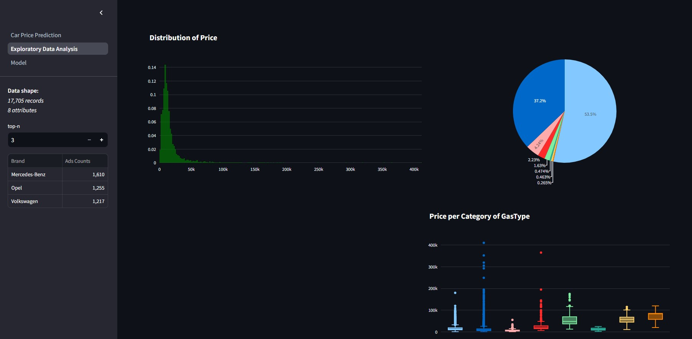

# ML Web-App using streamlit framework

## Description
Three page web-app for car price prediction using real-world webscraped data. 

## Process to open the app locally
  1. `git clone` the repository
  2. create a virtual enviroment
  3. install the requirements.txt file using `pip install -r requirements.txt`
  4. run `python -m streamlit run Car_Price_Prediction.py` to render the app on your local browser

##

